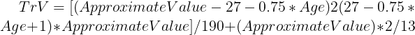

## Overview    
\
This github repository houses Chicago Bulls reproducible data analysis project, and contains data files detailing the performances of all of the basketball teams and players in the National Basketball Association (NBA) in the 2018/2019 season. This project contains information regarding what player metrics are related to scoring points and team success in basketball.  \
\
The purpose of this project is to find the best five starting players, based on the player metrics related to point scoring for the Chicago Bulls within the $118 million dollar player contract budget for the 2019-2020 season.  \
\
The outcome of this project is a report generated for the General Manager of the Chicago Bulls, detailing the best five starting players that the team can afford within their player contract budget of $118 million dollar for the 2019-2020 season, leaving adequate budget for the remaining, non-starting players. The results of this project will aim to improve the team's winning percentage and overall finishing position in the NBA.  \
\
\
**Credits:**  \
Jocelyn Mara, University of Canberra  \
\
**Data Sources and Variable Description** 
\
The data for this project consists of five data sets, saved as .csv files.  \
\
1.	2018-19_nba_player-statistics.csv sourced from [basketball-reference.com](https://www.basketball-reference.com/leagues/NBA_2019_totals.html)  \
\
2.	2018-19_nba_player-salaries.csv sourced from [hoopshype.com/salaries]( https://hoopshype.com/salaries/)  \
\
3.	2019-20_nba_team_payroll.csv sourced from [hoopshype.com/salaries]( https://hoopshype.com/salaries/)  \
\
4.	2018-19_nba_team-statistics_1.csv sourced from [basketball-reference.com](https://www.basketball-reference.com/leagues/NBA_2019.html)  \
\
5.	2018-19_nba_team-statistics_2.csv sourced from [basketball-reference.com]( https://www.basketball-reference.com/leagues/NBA_2019.html)  \
\
A description of variables commonly used in basketball can be found by clicking on the hyperlink below:  \
\
[Glossary of Basketball Metrics](https://www.basketball-reference.com/about/glossary.html)  \
\
**Formulas**  \
Basketball specific algorithms were used in this analysis, with relevant formulas detailed below, sourced from [NBA Advanced Metrics](https://bleacherreport.com/articles/1039116-understanding-the-nba-explaining-advanced-offensive-stats-and-metrics)  \
\
**Effective Field Goal Percentage (eFG)**  \ 
\
Assesses a player's field goal percentage (eFG), taking into account the fact that a three-point field goal is worth more than a two-point field goal.  \
\
  \
\
**Player Efficiency (EFF)**  \
\
The player efficiency (EFF) metric was included in the analysis as it provides an overall total performance statistic that measures a player's performance above the number of points produced, by summing the positive actions (points, rebounds, assists, steals, and blocks), and subtracting the negative actions (missed field goals, missed free throws, and turnovers).  \
\
  \
\
**Total Rebounds per Minute (TRB_MP)**
Total rebounds per minute (TRB_MP) is the total number of offensive and defensive rebounds divided by minutes played.  \
\
  \
\
**Team Usage**  \
\
Team usage is the total amount of time that the player is on the court being used by the team during a game or season. This metric was included in the model, as the higher a player's usage figure is, the more likely that the team values that player as an integral component of the team whilst on court.  \
\
**Trade Value (TrV)**  \
\
Trade value (TrV) estimated using a player's age and approximate value, as an indication of how much value a player has remaining in their career.  \
\
  \
\
**Points per minute**  \
\
Points per minute was included in the analysis to accurately compare points across players. Per-minute ratings were also used to calculate players' totals in other metrics including points, steals, blocks, assists, turnovers etc, and  are calculated by taking the player's total in the relevant metric and dividing by the total of minutes played.  \
\
**Win percentage**  \
\
To calculate winning percentage, the number of wins is divided by the number of games played. Team winning percentage was included in the model to explore the relationship of the individual player metrics and their contribution to a team's winning percentage.  \
\
\
**File Locations**  
\
The project files can be found in the GitHub repository melcrunkhorn/Bulls_Project. The main project file is: Data_Analysis_Project_Chicago_Bulls, and inside this folder is the Bulls_Project folder that contains the following folders:  \
\
**Data:** This folder contains two more folders:  \
\
1.	Project_Data: Containing the five raw data .csv files.   
\
2.	Tidy_Data: Containing the clean data .csv files used in the analysis.  \
\
**Funcs:** This folder contains the R script files for the project to run, which are detailed below:  \
\
1.	Bulls_Project.R  \
2.	Teams_wins_loss_df2.R  \
3.	Exploratory_Analysis_2.R  \
4.	Multiple_linear_regression_final.R  \
\
**Images**: This folder contains the .png image files for the algorithms used in the analysis, that were imported into the Readme and R Markdown files.  \
\
**References:** This folder contains the references imported into the Readme and R Markdown files.  \
\
\
**Project Navigation Instructions**  \
\
To navigate this project, the following scripts found in the Funcs folder are required to run in the order outlined below:  \
\
**1.	Bulls_Project.R**  \
This script is the first script in the project, where a thorough data wrangling and cleaning process of the raw data files takes place, combining datasets, handling missing values and duplicates. At the completion of the script the below .csv files are exported and saved in the Data/Tidy_Data location to be used in subsequent scripts:  \
data/tidy_data/player_stats_tidy.csv  \
data/tidy_data/df_TOT_players.csv  \
data/tidy_data/df_team_Stats2.csv  \
data/tidy_data/df_team_Stats1.csv  \
\
**2.	Teams_wins_loss_df.R**  \
This script is the second script in the project, and the above exported files are read in to the script. The data wrangling and cleaning process continues in this script with the team data, combining data sets and handling missing values and duplicates. At the completion of the script the df_nonTOT_clean.csv file is exported to the Data/Tidy_Data folder to used in the exploratory analysis script.  \
\
**3.	Exploratory_Analysis.R**  \
This script is the third script in the project and the df_nonTOT_clean.csv file is read in to this script for exploratory analysis to begin. This script contains the exploratory analysis components of the project and has outputs from the data set illustrating the distribution and relationships of variables related to success in basketball. A simple linear regression is included in this script to explore the correlation between points per minute and winning percentage to inform the modelling and results section of the report.  \
\
**4.	Multiple_linear_regression.R**  \
This is the fourth script in the project, and this script forms the modelling and results section of the project. The df_nonTOT_clean.csv file is read in to this script for further analysis and modelling. The results generated from this script are exported in to the R Markdown file and inform the starting player recommendations for the General Manager.  \
\
\